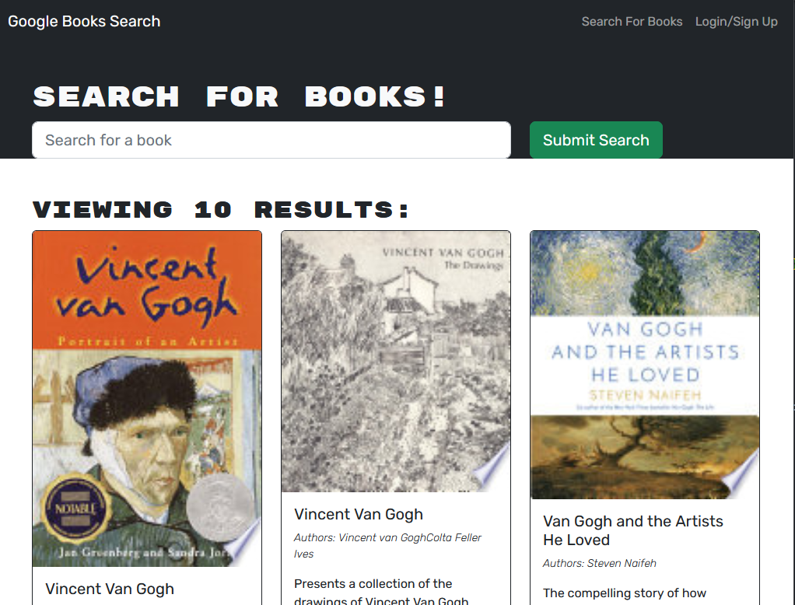

# Book Search Engine

## Description
A simple app for authenticated users to manage their personal library that leverages the Google Books API.  Book Search Engine is built using the **MERN** stack ([MongoDB](https://www.mongodb.com/), [Express](https://expressjs.com/), [ReactJS](https://react.dev/), and [Nodejs](https://nodejs.org/en)).  A [GraphQL](https://graphql.org/) API connects the back-end data store to the single-page application in the browser. [JSON Web Tokens](https://jwt.io/) authenticate each logged-in request from the browser to the API.
  
**Book Search Engine Live Example: [https://kitrath-book-search.herokuapp.com](https://kitrath-book-search.herokuapp.com/)**
## Installation
For local development:
1. Clone this repository: `git clone git@github.com:kitrath/book-search-engine`
2. Navigate to the base directory: `cd book-search-engine`
3. Install dependencies: `npm install`
6. Start the server: `npm run develop`
7. Visit `http://localhost:3000` in your browser (your default browser should open automatically)
## Usage
Click Login/Signup in the top right.  Choose Sign Up from the options on the modal popover to create an account.  Once you have created an account, you can log in with an email and a password.  A logged in user can conduct searches on the Google Books API and select books to save in their library.  All saved books for a user can be seen when logged in by clicking See Your Books in the top bar.  A user can browse through their saved books and remove books that have already been read.

## Screenshot

